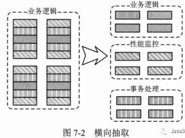

# 什么是  Aspect Oriented Program 面向切面编程？

## 背景

如果代码重复了怎么办？
	抽取成方法
	抽取类
		
抽取成类的方式我们称之为：纵向抽取，
通过继承的方式实现纵向抽取。

如果逻辑(开始、结束、提交事务)依附在我们业务类的方法逻辑中，纵向抽取的方式解决不了。  

## 思想

将分散在各个业务逻辑代码中相同的代码通过横向切割的方式抽取到一个独立的模块中。

把功能分为核心业务功能，和周边功能
	核心业务
		比如登陆，增加数据，删除数据都叫核心业务
	周边功能
		比如性能统计，日志，事务管理等等 

周边功能在 Spring 的面向切面编程AOP思想里，即被定义为切面。  

核心业务功能和切面功能分别独立进行开发，然后把切面功能和核心业务功能 "编织" 在一起，这就叫AOP。  

  

## 目的

能够将那些与业务无关，却为业务模块所共同调用的逻辑或责任（例如事务处理、日志管理、权限控制等）封装起来。  
便于减少系统的重复代码，降低模块间的耦合度，并有利于未来的可拓展性和可维护性。  
将重复性的逻辑代码横切出来，封装成类。
将这些被横切出来的逻辑代码融合到业务逻辑中。  

这就是AOP首要解决的问题。  
