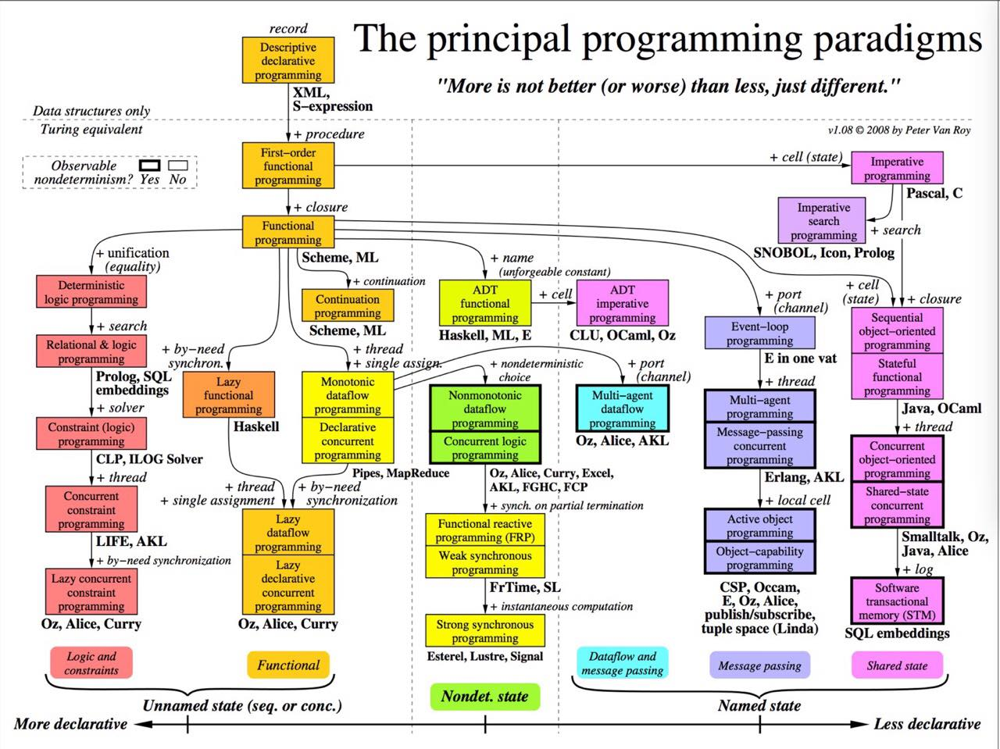

# 编程范式

Table of Contents
=================

   * [<a href="WhatIs.md">What Is Programming Paradigm?</a>](#what-is-programming-paradigm)
   * [<a href="ImperativeP/README.md">Imperative Programming（命令范式）</a>](#imperative-programming命令范式)
      * [Procedural Programming (过程式)](#procedural-programming-过程式)
      * [Structured Programming （结构化过程式）](#structured-programming-结构化过程式)
   * [<a href="OOP/README.md">OOP (Object-Oriented Programming)</a>](#oop-object-oriented-programming)
   * [<a href="DeclarativeP/README.md">Declarative Programming (声明范式)</a>](#declarative-programming-声明范式)
      * [<a href="FP/README.md">FP (Functional Programming)</a>](#fp-functional-programming)
      * [<a href="">LP (Logic Programming)</a>](#lp-logic-programming)
   * [<a href="RP/README.md">Reactive Programming</a>](#reactive-programming)
   * [<a href="EventDrivenP/README.md">Event-Driven Programming</a>](#event-driven-programming)
   * [<a href="ConcurrentP/README.md">Concurrent Programming</a>](#concurrent-programming)
   * [<a href="">GP (Generic Programming)</a>](#gp-generic-programming)
   * [<a href="AOP/README.md">AOP（Aspect-Oriented Programming）</a>](#aopaspect-oriented-programming)
   * [<a href="">Knowledge-based programming (基于知识的编程)</a>](#knowledge-based-programming-基于知识的编程)
   * [<a href="SymbolicP/README.md">Symbolic programming (符号式编程)</a>](#symbolic-programming-符号式编程)

